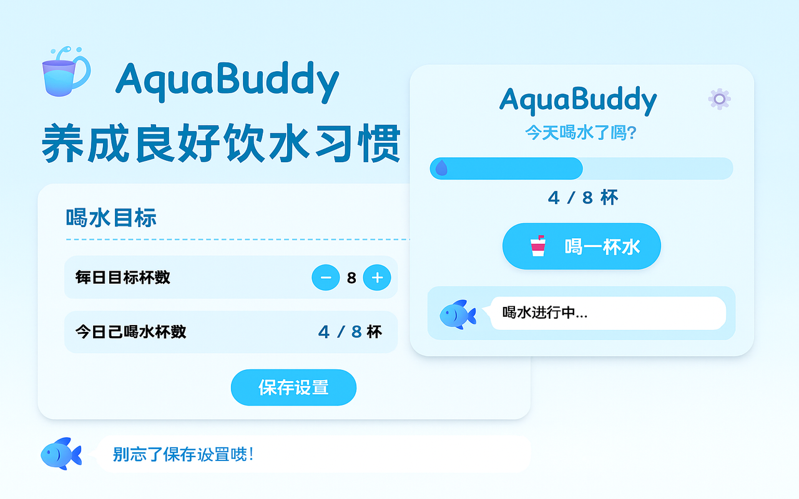

## AquaBuddy - 喝水小助手 🐳

AquaBuddy 是一个可爱风格的浏览器扩展，帮助您记录每日饮水情况。通过简单直观的界面，让您轻松养成健康的饮水习惯。



### 安装使用
- [Chrome Web Store](https://chromewebstore.google.com/detail/ogfdloamkhhelleacajfelmiieobccje)

### 主要功能

- 🥤 **喝水追踪**：记录您每天的饮水情况
- 🎯 **个性化目标**：设置每日饮水目标杯数
- 🔔 **智能提醒**：自定义提醒间隔和时间范围
- 🌈 **可爱界面**：轻松愉快的用户体验
- 🔄 **自动重置**：每天自动更新饮水记录

### 使用方法

1. 点击浏览器工具栏中的 AquaBuddy 图标打开 popup 界面
2. 每次喝水后，点击"喝一杯水"按钮记录
3. 通过设置页面自定义每日目标杯数和提醒方式
4. 享受健康的饮水习惯！

### 设置选项

#### 喝水目标
- **每日目标杯数**：调整您的每日饮水目标
- **重置今日记录**：随时重置当天的饮水记录

#### 通知设置
- **定时提醒**：开启/关闭喝水定时提醒功能
- **提醒间隔**：选择预设间隔或设置自定义时间（1-480 分钟）
- **提醒时间范围**：设置一天中接收提醒的时间段（默认 9:00-18:00）
- **工作日提醒**：选择是否仅在工作日（周一至周五）接收提醒

### 通知功能详解

AquaBuddy 的通知系统设计灵活，可根据个人习惯进行精确调整：

1. **开启定时提醒**：通过开关按钮轻松控制提醒功能
2. **选择提醒频率**：
   - 使用预设选项（30 分钟、1 小时、2 小时等）
   - 设置自定义间隔，范围从 1 分钟到 8 小时（480 分钟）
3. **设置时间范围**：
   - 使用精美时间选择器设置开始和结束时间
   - 避免在非工作时间收到打扰
4. **工作日模式**：
   - 开启后仅在周一至周五接收提醒
   - 关闭则每天都会收到提醒

### 二次开发

fork 仓库后，可以通过以下命令进行本地开发。

```shell
npm install
npm run dev
```

### 喝水小贴士

- 成年人每天应饮用约 8 杯（2 升）水
- 均匀分布饮水时间，避免一次性大量饮水
- 晨起喝一杯水有助于激活身体机能
- 饮水不足可能导致疲劳、头痛和注意力不集中

喝点水吧，健康生活从现在开始！

### 常见问题

**Q: 为什么我没有收到通知？**  
A: 请检查浏览器通知权限设置。在 Windows 系统中，可前往"设置 > 系统 > 通知与操作"中检查 Chrome 的通知权限。

**Q: 如何自定义提醒间隔？**  
A: 在提醒间隔下拉菜单中选择"自定义..."选项，然后在出现的输入框中设置您需要的分钟数（1-480）。

**Q: 通知会在我不工作的时间打扰我吗？**  
A: 不会。您可以设置提醒时间范围和工作日提醒选项，确保只在适当的时间收到提醒。
